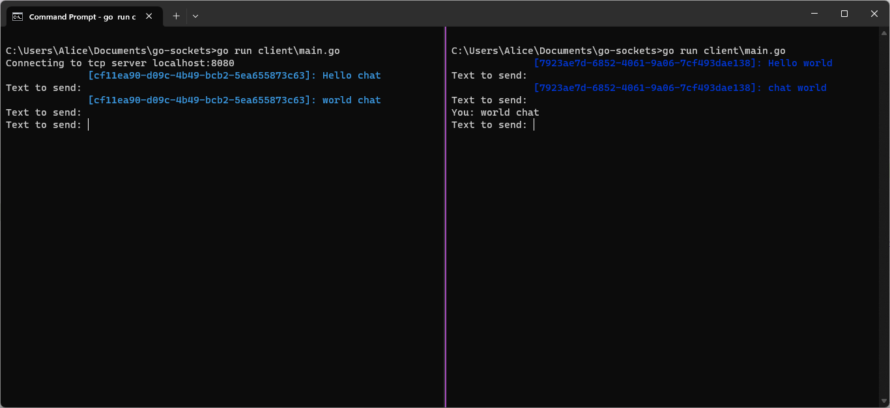

# Go-Sockets: A Simple Chat Application

Go-Sockets is a lightweight chat application built using the Go programming language. It allows multiple clients to connect over sockets and communicate in real-time. Each client is assigned an anonymized unique identifier (UUID), ensuring privacy and anonymity.

Example chat interaction with two clients.


## Features

- **Simple Server-Client Architecture**: Utilizes Go's built-in `net` package to establish TCP connections.
- **Anonymized IDs for Clients**: Each client is assigned a randomized UUID to ensure privacy.
- **Concurrent Handling**: The server can handle multiple client connections concurrently, thanks to Go's Goroutines.

## Prerequisites

- [Go](https://golang.org/dl/) (Version 1.20.6 or newer is recommended)
- [Visual Studio Code](https://code.visualstudio.com/) (Recommended for development)
- [Go Extension for Visual Studio Code](https://marketplace.visualstudio.com/items?itemName=golang.Go) (For enhanced Go development experience in VS Code)

## Installation & Usage

1. **Clone the Repository**:

   ```bash
   git clone https://github.com/avaavarai/go-sockets.git
   cd go-sockets
   ```

2. **Install Dependencies**:

   ```bash
   go get github.com/google/uuid
   ```

3. **Run the Server**:

   ```bash
   go run server\main.go
   ```

   This starts the server on `localhost:8080`.

4. **Run the Client**:

   In a new terminal window or instance:

   ```bash
   go run client\main.go
   ```

   This connects the client to the server. You can run multiple clients to simulate a chat environment.

## Contributing

We welcome contributions! Please feel free to submit pull requests, report bugs, and suggest new features.

## License

This project is available under the GPL-3.0 License. See [LICENSE](./LICENSE) for more details.
